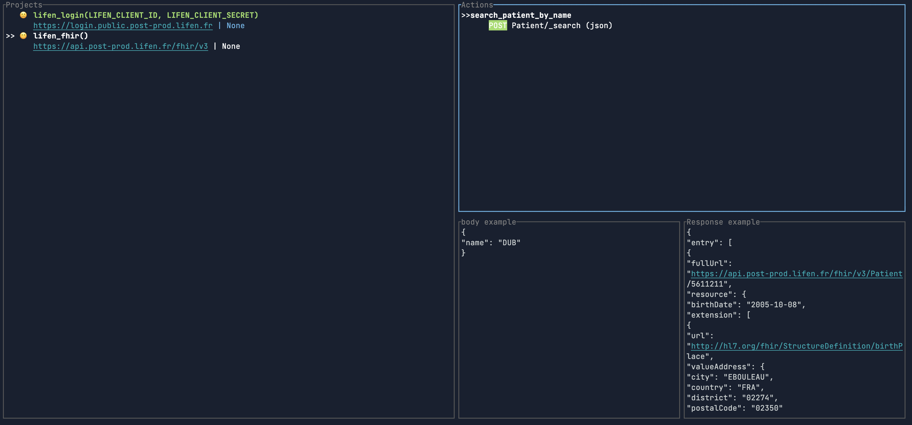
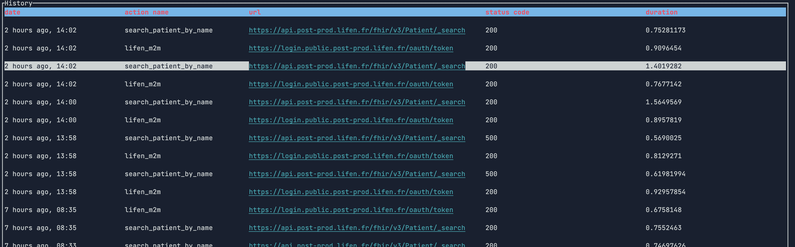
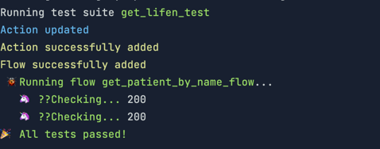

# 😁🦀 apicrab
CLI tools to manage your json api call in the terminal for fun only !

> [!WARNING]
> Tested on MacOs only

## Philosophy

The goal of this project is to provide a simple tool to manage your json api call in the
terminal. It's not meant to be used in production. It's just a fun project to learn rust.

First notion is the **project**. A project has a name and root urls for an api to test, and
optionally a set of **configuration variables**. You can then attach **actions** to your
project.

An **action** represents a specific endpoint of your api. It has a name, a method (http verb), 
an url.

You can run an action with a set of **parameters** such body, path parameters, and query 
parameters.

A **flow** represents a set of actions to run with predefined parameters. You also can chain 
actions to create a flow.

## Features
- [x] Create a new project
- [x] Add an action to your project
- [x] Run an action
- [x] Extract data from your response using jsonpath (not fully implemented yet)
- [x] Chain actions
- [x] Test your action

## Build from source
Install rust
```bash
curl --proto '=https' --tlsv1.2 -sSf https://sh.rustup.rs | sh
```
Clone the repo
```bash
git clone url_of_project
```
Build the project
```bash
cargo build --release
```
Add the binary to your path
```bash
export PATH=$PATH:/path/to/apicrab/target/release
```

## Usage
```bash
apicrab --help
```

## Example

Create a new project
```bash
apicrab project new myproject --test-url https://jsonplaceholder.typicode.com

```

Add an action to your project
```bash
apicrab project add-action myproject -n get-todo -v GET --url /todos/{id}
```

Get information about  your actions
```bash
apicrab project info myproject
```
Or using the ui
```bash
apicrab project ui myproject
```



Run your action
```bash
apicrab run action get-todo -p id:1
```
```
Request took: 265.607263ms
Status code: 200
Action updated
Received response: 
{
  "completed": false,
  "id": 1,
  "title": "delectus aut autem",
  "userId": 1
}
...
```

Chain action
```
# project as been created with configuration parameters CLIENT_ID and CLIENT_SECRET
apicrab project add-action myproject -n authent\n
--static-body '{client_id:"{CLIENT_ID}", "client_secret": "{CLIENT_SECRET", "grant-type": "client_credentials"}' \n
-u oauth/token --form

apicrab project add-action myproject -n search_by_name\n
-u todos?name={name}
-h 'Authorization: Bearer {ACCESS_TOKEN}'

apicrab run action authent -q '' -e access_token:ACCESS_TOKEN\n
--chain search_by_name -q 'name:Buy tomatoes' -e $ --save-as get-todo-by-name-flow

apicrab run flow get-todo-by-name-flow

```

Extract data from your response using jsonpath (not fully implemented yet)
```bash
apicrab run action get-todo -p id:1 -e completed
```
```
Request took: 286.501417ms
Status code: 200
Action updated
Extraction of completed: false 
```

List all requests history
```bash
apicrab history list
```
or using the ui
```bash
apicrab history ui
```


Save your action as flow to avoid repeating yourself. This one is fairly simple.
```bash
apicrab run action get-todo -p id:1 -e completed:COMPLETED --save-flow get-todo
```

Then you just have to run
```bash
apicrab run flow get-todo
```

Flow are especially useful to test your api. You can add expectations to your flow.
```bash
apicrab test-suite new mytest
apicrab test-suite add-flow mytest -n get-todo --expect COMPLETED:false --expect STATUS_CODE:200

apicrab run test-suite mytest
```
Gives the following output



## Built with
- clap
- sqlx
- reqwest
- serde
- serde_json
- ratatui
- colored
- tokio

## Ideas

- [ ] Add a way to save your project in a file
- [ ] Add a way to load your project from a file
- [ ] Share your project with others
- [ ] Improve the ui


## Contributing

If you want to contribute to this project, you're welcome. Just open an issue or a pull request.

## License
MIT